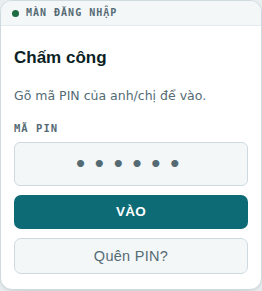
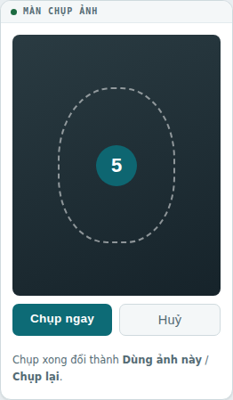
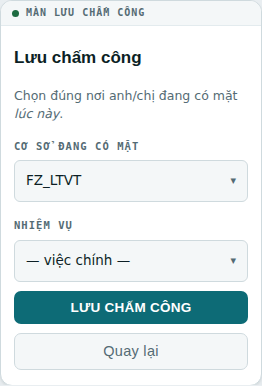
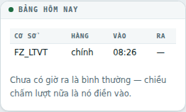
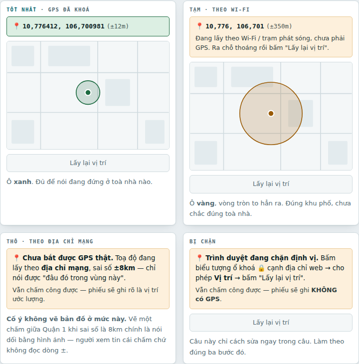
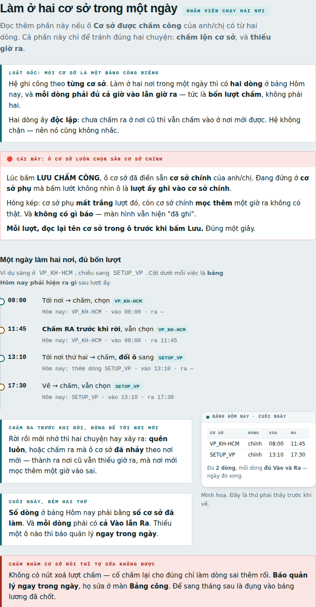

# Quy trình chấm công online bằng điện thoại

Bản dán ở cơ sở và gửi Zalo cho nhân viên mới. Mô tả đúng hành vi của **Chấm công 3.81.0**; câu
chữ ở bảng tra lỗi lấy **nguyên văn** từ hệ thống.

> **Bản gửi cơ sở**
> * Trang web: https://claude.ai/code/artifact/932a3d87-5f0a-4680-87dd-e94cec6743c9
> * **PDF in / gửi Zalo**: [`QUY-TRINH-CHAM-CONG-ONLINE.pdf`](QUY-TRINH-CHAM-CONG-ONLINE.pdf) — 10 trang A4
> * Nguồn của cả hai: [`quy-trinh-cham-cong-online.html`](quy-trinh-cham-cong-online.html)
>
> Sửa tài liệu thì sửa tệp `.html`, rồi xuất lại PDF bằng:
> ```
> node tools/xuat-pdf.js docs/quy-trinh-cham-cong-online.html docs/QUY-TRINH-CHAM-CONG-ONLINE.pdf
> ```

---

## 1. Nhân viên — năm bước

### 1. Mở trang chấm công

Bằng **Chrome / Safari**. ⚠️ Đừng mở trong trình duyệt của Zalo hay Facebook — mấy cái đó hay
chặn camera, và nút chụp bấm không lên.

### 2. Gõ PIN 6 số → VÀO



Quên thì bấm **Quên PIN?** rồi gõ **CCCD**.

### 3. Bấm 📷 CHẤM CÔNG, để máy tự chụp



Cho phép **camera**, đưa mặt vào khung, máy **đếm ngược 5 giây rồi tự chụp** — không phải bấm gì.
Xong thì *Dùng ảnh này* / *Chụp lại*.

### 4. Chọn đúng cơ sở ĐANG ĐỨNG



Ô **Nhiệm vụ** chỉ hiện với ai có khai thêm việc. Xong bấm **LƯU CHẤM CÔNG**.

### 5. Nhìn mục "Hôm nay" để chắc đã ghi



Không thấy dòng nào = lượt đó **chưa ghi**, làm lại. Chưa có giờ ra là bình thường — chiều chấm
lượt nữa là nó điền vào.

> Ảnh trong tài liệu này là **minh hoạ tự vẽ**, không phải ảnh chụp màn hình thật: chụp thật thì
> phải đăng nhập bằng hồ sơ của một người và lộ toạ độ nhà họ.

### Mấy điều hay bị hiểu nhầm

* **Vào và ra dùng CHUNG một nút.** Lượt đầu trong ngày = giờ vào; lượt sau = giờ ra, và mỗi
  lượt muộn hơn lại đẩy giờ ra ra sau. Bấm hai lần trong cùng một giây thì lượt thứ hai bị bỏ
  qua — không đè mất giờ vào.
* **Hỏi cơ sở ở BƯỚC CUỐI, không hỏi lúc mở trang.** Hỏi lúc mở thì người chạy hai nơi chọn từ
  sáng, chiều sang chỗ khác vẫn còn nguyên lựa chọn cũ — và giờ vào ghi nhầm cơ sở.
* **"Cơ sở chính" không phải hạng nhất.** Nhãn *chính* chỉ nghĩa là cơ sở được **chọn sẵn** trong
  ô. Chấm ở cơ sở nào trong danh sách cũng **tính công đủ như nhau**.
* **Giờ in trên ảnh là giờ MÁY CHỦ**, không phải giờ điện thoại. Điện thoại lệch giờ không ảnh
  hưởng gì tới công.
* **Vị trí nên bật nhưng KHÔNG bắt buộc.** Trong nhà hay dưới hầm thường không bắt được — vẫn
  chấm công bình thường, phiếu chỉ ghi rõ là vị trí ước lượng. Đừng đứng chờ định vị.

### Ô "Vị trí đang đứng" trông như thế nào



Chỉ cần nhớ hai thứ: **màu của ô** và **con số ± phía sau**.

| Sai số | Màu | Nghĩa là gì |
|---|---|---|
| ≤ 50m | 🟢 xanh | GPS đã khoá — nói được đang đứng ở **toà nhà nào**. |
| ≤ 200m | 🟡 vàng | GPS chưa khoá hẳn — đúng **khu phố**. Đợi vài giây thì số này nhỏ lại. |
| ≤ 2km | 🟡 vàng | Theo **Wi-Fi / trạm phát sóng**, chưa phải GPS. Chỉ đúng phường, quận. |
| > 2km | 🟡 vàng | Theo **địa chỉ mạng** — **không** dùng để xác nhận có mặt. |

🔴 **Ở mức > 2km hệ CỐ Ý không vẽ bản đồ.** Vẽ một chấm giữa Quận 1 khi sai số là 8km chính là
nói dối bằng hình ảnh — người xem tin vào cái chấm chứ không đọc dòng ±.
* **Gõ PIN sai 12 lần / 10 phút** là bị chặn tạm — hệ đếm theo **đường mạng**, không theo người,
  nên cả cửa hàng dùng chung wifi bị chặn theo. Chờ hết 10 phút, hoặc chuyển sang 4G.

---

## 1b. Làm ở HAI cơ sở trong một ngày

Chỉ đọc phần này nếu ô **Cơ sở được chấm công** có từ hai dòng. Cả phần này để tránh đúng hai
chuyện: **chấm lộn cơ sở** và **thiếu giờ ra**.

### 🔴 Luật gốc: mỗi cơ sở là một bảng công RIÊNG

Hệ ghi công theo **từng cơ sở**. Làm hai nơi trong một ngày thì bảng Hôm nay có **hai dòng**, và
**mỗi dòng phải đủ cả giờ vào lẫn giờ ra** — tức **bốn lượt chấm**, không phải hai.

Hai dòng ấy **độc lập**: chưa chấm ra ở nơi cũ thì vẫn chấm vào ở nơi mới được. Hệ **không chặn**
— nên nó cũng **không nhắc**.

### 🔴 Cái bẫy: ô cơ sở luôn chọn sẵn cơ sở CHÍNH

Lúc bấm **LƯU CHẤM CÔNG**, ô cơ sở đã điền sẵn **cơ sở chính**. Đang đứng ở **cơ sở phụ** mà bấm
lướt không nhìn ô là **lượt ấy ghi vào cơ sở chính**.

Hỏng kép: cơ sở phụ **mất trắng** lượt đó, cơ sở chính **mọc thêm** một giờ ra không có thật. Và
**không có gì báo** — màn hình vẫn hiện "đã ghi".

> **Mỗi lượt, đọc lại tên cơ sở trong ô trước khi bấm Lưu.** Đúng một giây.

### Một ngày làm hai nơi, đủ bốn lượt

| Lúc | Việc | Bảng Hôm nay sau đó |
|---|---|---|
| 08:00 | Tới nơi → chấm, chọn `VP_KH-HCM` | VP_KH-HCM · vào 08:00 · ra — |
| 11:45 | **Chấm RA trước khi rời**, vẫn `VP_KH-HCM` | VP_KH-HCM · vào 08:00 · ra 11:45 |
| 13:10 | Tới nơi thứ hai → chấm, **đổi ô** sang `SETUP_VP` | thêm dòng SETUP_VP · vào 13:10 · ra — |
| 17:30 | Về → chấm, vẫn `SETUP_VP` | SETUP_VP · vào 13:10 · ra 17:30 |



**Chấm RA trước khi rời, đừng để tới nơi mới.** Rời rồi mới nhớ thì hoặc **quên luôn**, hoặc chấm
ra mà ô cơ sở **đã nhảy** theo nơi mới — nơi cũ vẫn thiếu giờ ra, nơi mới mọc thêm một giờ vào sai.

**Cuối ngày đếm hai thứ:** số dòng = số cơ sở đã làm, và mỗi dòng có **cả Vào lẫn Ra**. Thiếu ô
nào thì báo quản lý **ngay trong ngày**.

⚠️ **Chấm nhầm cơ sở rồi thì tự sửa không được** — không có nút xoá lượt chấm, cố chấm lại chỉ
làm dòng sai thêm rối. Báo quản lý sửa ở màn **Bảng công**, trong ngày.

---

## 2. Bảng tra: màn hình báo gì thì làm gì

| Màn hình hiện | Nghĩa là gì · làm gì | Ai sửa |
|---|---|---|
| `Phiên đã hết — đăng nhập lại bằng PIN.` | Để trang mở quá lâu. Gõ lại PIN, không mất gì. | Tự làm |
| `Hồ sơ của … chưa tích cơ sở nào, nên lượt chấm không biết ghi vào đâu.` | Mở hồ sơ người này, tích ít nhất một ô ở lưới **Cơ sở** rồi Lưu. | Quản lý |
| `Cơ sở "…" … đang đặt là CHỈ QUẢN LÝ — không chấm công ở đó.` | Hồ sơ CÓ cơ sở đó nhưng đánh dấu **chỉ QL**. Nay có làm thật thì bỏ ô ấy. | Quản lý |
| `Bạn không có ở cơ sở "…". Chọn lại cơ sở.` | Chọn nhầm. Chọn lại; thật sự mới chuyển thì nhờ tích thêm cơ sở. | Tự làm |
| `Bạn không được khai nhiệm vụ "…".` | Bỏ chọn nhiệm vụ là chấm được ngay; muốn tính đúng việc thì bổ sung ở hồ sơ. | Admin |
| `Giờ này không thuộc hàng tăng ca / ca đêm.` | Chỉ gặp ở khối Văn phòng. Báo quản lý, **đừng chấm lại nhiều lần**. | Quản lý |
| `Tài khoản này chưa bật chấm công online.` | Hồ sơ chưa có **Mã NV**. | Quản lý |
| **"PIN không đúng" dù gõ đúng PIN** | 🔴 Gần như chắc là **vai trò trong hồ sơ ghi một tên hệ không có**. Cổng chối nhưng chỉ nói được "PIN không đúng". Xem dải **⛔ vai không vào được cổng** ở màn Quản lý nhân sự. | Kế toán |
| Quên PIN → `Hồ sơ có nhưng chưa được cấp mật khẩu đăng nhập.` | Hồ sơ có thật nhưng chưa ai cấp PIN. Quản lý mở hồ sơ, đặt PIN 6 số rồi Lưu. | Quản lý |
| Bấm 📷 mà không lên camera | Chưa cho phép camera, hoặc đang ở trình duyệt Zalo/Facebook. | Tự làm |
| `📍 Chưa bắt được vị trí` | Bình thường khi ở trong nhà. **Vẫn chấm được.** | Bỏ qua |

**Trang đứng im, không hiện gì:** mở địa chỉ trạm rồi thêm `?viec=chan_doan` vào cuối. Nó in ra
một trang chữ (bản plugin, giờ máy chủ, bảng đã dựng chưa) — **chụp màn hình gửi đi**. Đường ấy
không in tên ai, không in PIN.

---

## 3. Cửa hàng trưởng — soát trước khi cho một người chấm

Thiếu một ô là người ta đứng ở quầy bấm mãi không được, mà màn hình báo một câu nghe như hỏng máy.

- [ ] Có **Mã NV**
- [ ] Có **PIN 6 số**, và người ấy biết nó
- [ ] Đã **tích ít nhất một cơ sở**, và cơ sở họ thật sự làm **không** bị đánh dấu **chỉ QL**
- [ ] **Vai trò là một vai có thật** trong hệ

**Cuối ngày:** mở **Bảng công** của cơ sở, nhìn ai thiếu giờ ra. Quên chấm thì **chấm bù ngay
trong ngày** — để sang tháng mới sửa là đụng vào bảng lương đã chốt.

---

## 4. Admin / Kế toán — trước khi bật cho một cơ sở

### 🔴 Bật rồi thì lương phải tính TỪ HỆ THỐNG, không tính từ sheet

Từ lúc một cơ sở chuyển sang chấm online, lượt online **không còn vào sheet** — sheet chỉ còn
lượt của máy chấm công:

```
MySQL  = lượt máy (sao lại)  +  lượt online   -> ĐỦ
Sheet  = lượt máy                             -> THIẾU lượt online
```

Tính lương từ sheet là **thiếu công của đúng những người chấm bằng điện thoại**, mà khối Văn
phòng thì gần như chỉ chấm bằng điện thoại.

### ⚠️ Đối chiếu khuôn mặt: để chạy "im" vài tuần đã

Hệ so mặt **SAU khi giờ đã ghi** — mạng rớt giữa chừng chỉ mất phần đối chiếu, lượt chấm vẫn
nguyên. Đó là chủ ý: tính dãy đặc trưng cần tải vài megabyte model, ở cơ sở 3G mất hàng chục
giây; nhét chung vào lượt chấm là đổi một tiện ích lấy chính cái việc cả hệ thống sinh ra để làm.

Mặc định chế độ **`im`**: có so, có ghi nhật ký, **không gắn cờ**. Ngưỡng `0,60` là số của ngành
chứ không phải của K&H — nó đổi theo ánh sáng từng cơ sở và đời camera. Bật cờ ngay bằng số mặc
định dẫn tới một trong hai kết cục, cả hai đều hỏng:

* cả trăm cờ oan → hai tuần sau không ai mở màn cờ nữa, và **cờ THẬT chìm theo**;
* không cờ nào → tưởng mọi thứ sạch, trong khi ngưỡng đang quá lỏng.

Chạy im, đọc nhật ký, rồi mới chọn ngưỡng theo **số đo được**.

### Ảnh và băng thông

Ảnh thu nhỏ về **720px ngay trên điện thoại** trước khi gửi — cơ sở 3G vẫn chấm được, và không
cần dặn nhân viên chỉnh gì.

---

## Nằm ở đâu trong mã

| Việc | Tệp |
|---|---|
| Cửa trạm (đăng nhập PIN, các `viec=`) | `includes/class-vhcc-tram.php` |
| Giao diện trạm | `templates/tram.php` |
| Luật chấm công (4 chỗ gác) | `includes/class-vhcc-online.php` |
| Quyết định vào / ra | `includes/class-vhcc-nhan.php` → `quyet_dinh_gio()` |
| Đối chiếu khuôn mặt | `includes/class-vhcc-mat.php` |
