# QUY TRÌNH BÁO CÁO DOANH THU GHẾ & NỘP TIỀN

Áp dụng cho trang **/ghe** (plugin Ghế 2.139.0) và plugin Sao Kê 0.46.0. Soạn 24/09/2026 theo đúng
hành vi hệ thống đang chạy. Dùng cho: nhân viên thu tiền, cửa hàng trưởng, kế toán, quản trị.

> **Ảnh mẫu** trong tài liệu chụp từ giao diện thật của bản 2.139.0, chạy với **dữ liệu giả**
> (cơ sở GO BẾN TRE, nhân viên Nguyễn Văn A, số tài khoản 0123456789, mã nộp KH705MTDMN0012…).
> Không phải số liệu thật của công ty.

---

## 0. Bốn nguyên tắc

1. **Mỗi ngày, mỗi cơ sở một phiếu báo cáo** (thu hai lần trong ngày thì hai lần gửi, máy giữ cả hai).
   Tiền mặt rút khỏi ghế là tiền **đang cầm** của nhân viên cho đến khi kế toán bấm **Đã nhận**.
2. **Tổng doanh thu cơ sở = Thực thu tiền mặt (người đếm) + VietQR thực về ngân hàng (sao kê).**
   Chỉ số trên máy và số QR nhân viên đọc chỉ để đối chiếu, không phải doanh thu.
3. **Không ai xoá dòng tiền.** Sửa là ghi đè có dấu vết và hoàn tác được; xoá là chuyển vào thùng rác.
   Xoá cơ sở, đổi tên cơ sở, gộp cơ sở đều không mất một đồng.
4. **Chỉ ghế đã được kế toán duyệt mới xuất sang MISA.**

---

## 1. Vai trò và phạm vi

| Vai trò | Làm gì trên /ghe | Thấy cơ sở nào |
|---|---|---|
| **Nhân viên thu tiền / Cửa hàng trưởng** | Nhập báo cáo ngày, khai nộp tiền, đính bill, sửa trong 24 giờ, gửi đề nghị đặt lại mốc chỉ số | Cơ sở ghi trong hồ sơ nhân sự; nếu Quản trị cấp **PIN báo cáo** riêng thì phạm vi PIN thắng |
| **Kế toán** (nhóm "chốt doanh số") | Duyệt báo cáo, sửa báo cáo đã nộp (quyền riêng), khoá ngày, nhận tiền, đối soát QR, công nợ, xuất MISA, báo cáo tổng | Tất cả |
| **Quản trị** (Admin / Quản lý) | Mọi việc của kế toán + danh mục cơ sở, ghế, Mã KH, Unit ID, PIN, gộp cơ sở, sổ mồ côi, bổ sung doanh thu tháng cũ | Tất cả |
| **Hotline** | Điều khiển ghế, hỗ trợ khách; không đụng báo cáo | — |

Đăng nhập báo cáo bằng **PIN 4–8 số**. Sai 10 lần thì bị khoá 10 phút. Phiên đăng nhập sống 30 ngày.

---

## 2. Nhân viên: báo cáo hằng ngày

### 2.1 Bảy bước

1. Mở **/ghe → Báo cáo**, nhập PIN.
2. Chọn **cơ sở** (chỉ hiện cơ sở mình phụ trách) và **ngày** thu.
   Ngày không được quá 1 ngày tương lai, không cũ quá 366 ngày. **Ngày kế toán đã khoá thì không gửi được.**
3. Máy tự điền **Chỉ số trước** = chỉ số sau của lần thu gần nhất (ưu tiên cùng cơ sở).
   Ghế mới chưa có mốc thì nhập tay lần đầu. Cơ sở đánh dấu **"reset sau mỗi lần thu"** luôn có chỉ số trước = 0.
4. Với **từng ghế**, nhập:
   - **Chỉ số sau** (nhận số lẻ, ví dụ 551,5).
   - **QR**: số tiền QR đọc trên máy.
   - **Thực thu tiền mặt**: số tiền đếm được trong ngăn.
   - **Ghi chú** khi có gì bất thường.
   - Ảnh **📷 chỉ số** (bắt buộc nên có; thiếu thì máy hỏi lại) và **🧹 vệ sinh** nếu có.
5. Máy tính tại chỗ:
   - **Sản lượng** = (chỉ số sau − chỉ số trước) × 5.000đ/lượt (đơn vị do Quản trị cấu hình) − lượt kích từ xa đã cấp.
   - **Tiền mặt** = sản lượng − QR. **Nếu có gõ Thực thu thì Tiền mặt = Thực thu** (ghi đè, máy tự ghi chú).
   - **Tổng** = tiền mặt + QR.

   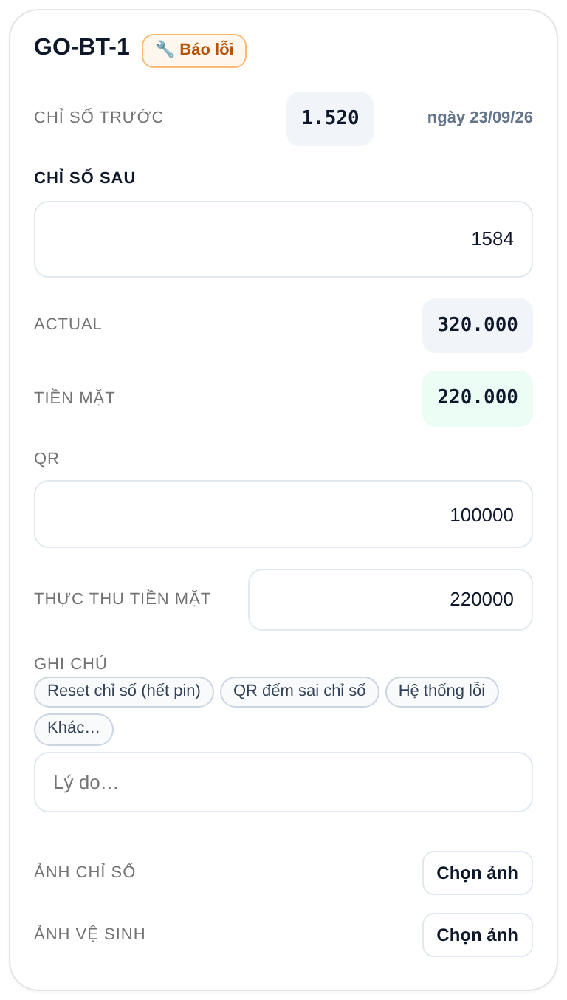

   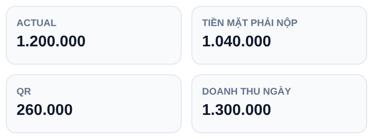

6. Cuối phiếu, khai **nộp tiền**: **Tiền mặt** / **Chuyển khoản** / **Chưa nộp**; số tiền nộp (để trống = nộp đủ phần tiền mặt).
7. Bấm **Gửi**. Mỗi lần gửi là một **lần thu** riêng trong ngày; mốc chỉ số tự nối cho lần sau.
   Thanh **Tiến độ** đếm x/y cơ sở đã gửi. Hôm nào không thu hết thì bấm **Chốt sớm** và ghi lý do.

   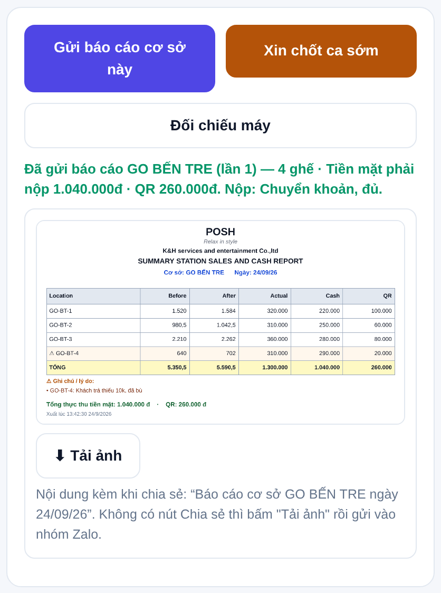

   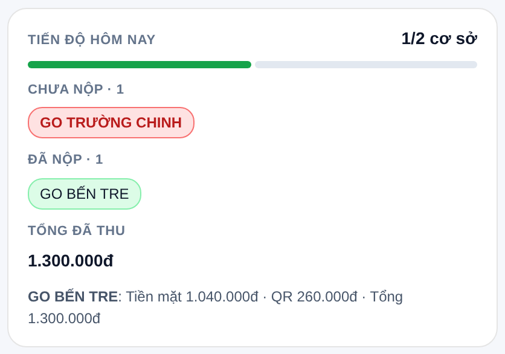

### 2.2 Máy chặn gì, cảnh báo gì

| Tình huống | Máy làm gì |
|---|---|
| Chỉ số sau < chỉ số trước, hoặc tiền mặt ra âm | **Chặn** cho tới khi có **Ghi chú lý do** và **Thực thu** cho đúng ghế đó |
| Máy đứng yên (sau = trước) nhưng có QR | Chỉ cần **Thực thu**, không cần lý do |
| Chỉ số sau vượt chỉ số của ngày kế tiếp đã nộp | **Cảnh báo**, không chặn |
| Thiếu ảnh ghế | Hỏi xác nhận, không chặn |
| Gửi lại y nguyên trong 120 giây | Bỏ qua (chống gửi trùng) |
| Ngày đã khoá | Chặn gửi, chặn sửa, chặn nộp bổ sung |

### 2.3 Sửa sau khi gửi

- **Trong 24 giờ**: mục *Gần đây* → sửa. Không sửa được nếu đã đính **bill nộp** hoặc ngày đã **khoá**.
  Không xoá trắng chỉ số sau; mỗi ghế vẫn phải còn ít nhất một ảnh. Sửa xong, yêu cầu của kế toán (nếu có) tự đóng.
- **Sau 24 giờ**: báo kế toán sửa (kế toán không bị giới hạn 24 giờ).
- **Ghế thay bo, mất mốc chỉ số**: gửi **Đề nghị** đặt lại hoặc xoá mốc (một ghế hoặc cả cơ sở), kèm ngày áp dụng.
  Kế toán duyệt thì mốc mới có hiệu lực từ ngày ấy; báo cáo cũ không đổi.
- **Báo cáo tổng** (khi chỉ có một con số cả cơ sở): nhập tổng + ảnh bắt buộc, tổng phải > 0.

---

## 3. Nộp doanh thu: từ tay nhân viên về kế toán

Tiền mặt của mỗi phiếu đi qua ba trạng thái. Chỉ khi kế toán bấm **Đã nhận** thì nợ của nhân viên
mới hết.

| Trạng thái | Màu trên màn | Nghĩa |
|---|---|---|
| **Đang cầm** | vàng | Tiền còn trong tay nhân viên (hoặc đã chuyển khoản nhưng chưa đính bill) |
| **Đã nộp, chờ kế toán** | xanh dương, có 🔒 | Nhân viên đã đính bill hoặc tạo lượt nộp; phiếu khoá sửa; kế toán chưa xác nhận |
| **Kế toán đã nhận** | xanh lá | Kế toán đã bấm Đã nhận; hết nợ phiếu này |

### 3.1 Khai nộp ngay trên phiếu báo cáo (bước 6 của mục 2)

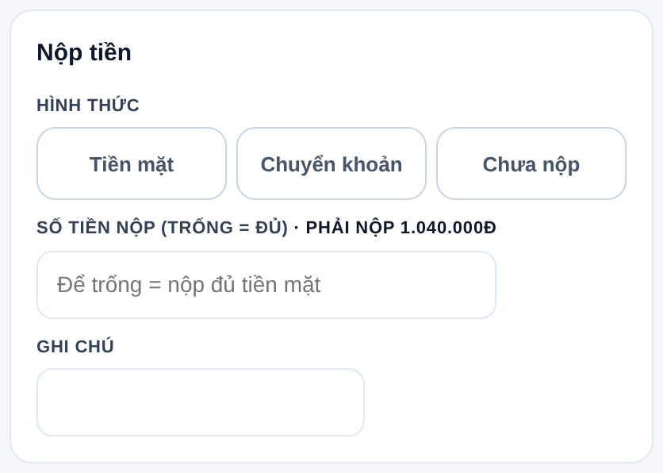

- Dòng **"Phải nộp …đ"** cạnh ô Số tiền chính là **Tiền mặt phải nộp** ở khối tổng: cộng Thực thu
  tiền mặt của từng ghế. **QR không nằm trong đây** vì đã vào tài khoản công ty.
- **Hình thức** (bấm một trong ba nút):
  - **Tiền mặt**: sẽ mang tiền về quầy / kế toán, nộp theo **Cách B** (mục 3.4).
  - **Chuyển khoản**: sẽ chuyển vào tài khoản công ty và đính bill, theo **Cách A** (mục 3.3).
  - **Chưa nộp**: hôm nay chưa nộp; phần tiền mặt ghi thành **nợ** trên phiếu, nộp bổ sung sau (mục 3.6).
- **Số tiền nộp**: **để trống = nộp đủ**. Gõ số nhỏ hơn = nộp thiếu, phần còn lại thành nợ trên phiếu.
- **Ghi chú**: ngân hàng, giờ chuyển, lý do nộp thiếu… (không bắt buộc).

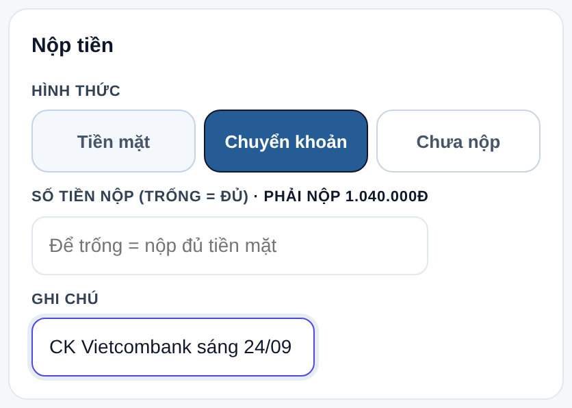

- **Ảnh chứng từ nộp tiền** (khối riêng, tuỳ chọn): QR chuyển khoản, hoá đơn… Không phải ảnh ghế.
  Khối này còn là đường **báo cáo TỔNG**: không điền bảng từng ghế, chỉ đính ảnh + gõ tổng doanh thu
  vào ô Số tiền nộp rồi Gửi.

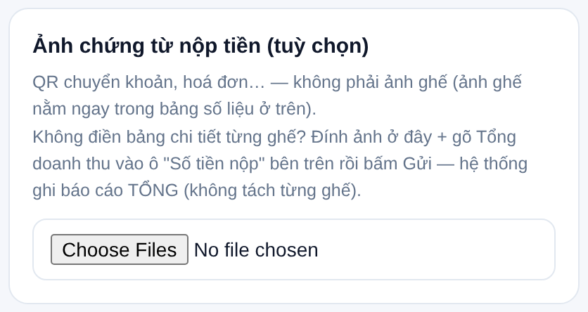

- Bấm **Gửi báo cáo cơ sở này**. Câu báo xanh nhắc lại: số ghế, tiền mặt phải nộp, QR, hình thức nộp.

### 3.2 Sau khi gửi: phiếu nằm ở "Báo cáo trong 24h"

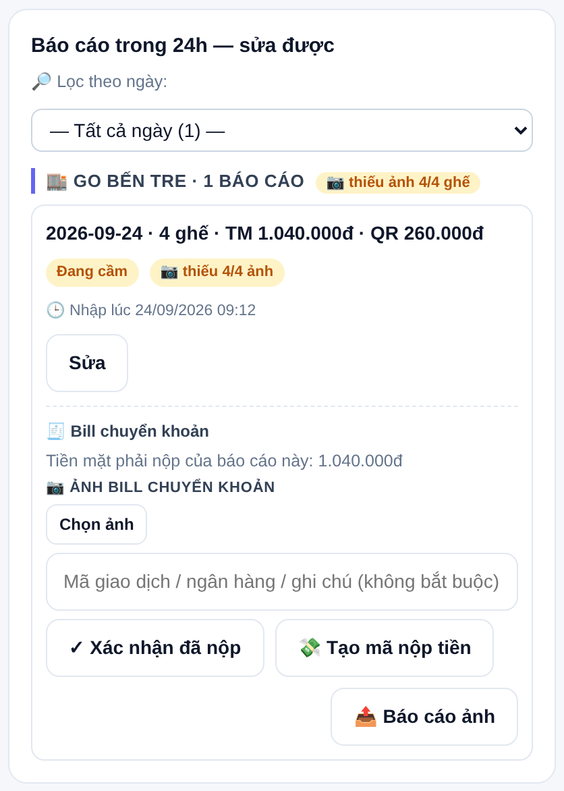

Mỗi phiếu là một thẻ: ngày · số ghế · **TM** (tiền mặt phải nộp) · **QR**, huy hiệu trạng thái tiền,
huy hiệu ảnh còn thiếu, giờ nhập. Dưới thẻ là khối **🧾 Bill chuyển khoản** với:
- dòng **"Tiền mặt phải nộp của báo cáo này"**: đúng số phải chuyển hoặc mang về;
- nút **💸 Tạo mã nộp tiền** và nút **✓ Xác nhận đã nộp**.
Phiếu **toàn QR** (tiền mặt 0đ) thì khối này ghi "không cần nộp", không có nút.

### 3.3 Cách A — chuyển khoản theo MÃ NỘP rồi đính bill (khuyến nghị)

**Bước 1. Bấm "💸 Tạo mã nộp tiền".** Máy dựng mã VietQR với **đúng số tiền mặt của phiếu**, tài
khoản nhận tiền chung của công ty, và **nội dung chuyển khoản = MÃ NỘP của cơ sở**.

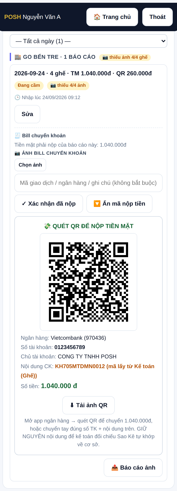

- Mở app ngân hàng, quét QR, kiểm tra số tiền và nội dung rồi chuyển. Không quét được thì bấm
  **Tải ảnh QR** hoặc chuyển tay đúng số tài khoản + **giữ nguyên nội dung**.
- **Vì sao phải giữ nguyên nội dung**: kế toán đối chiếu sao kê ngân hàng bằng mã này; sai nội dung
  thì khoản tiền không tự khớp về cơ sở, kế toán phải dò tay.
- Cơ sở **chưa có MÃ NỘP** thì máy báo và không tạo QR: kế toán đặt mã ở *Kế toán → Mã nộp tiền*
  (hoặc danh sách điểm bên Sao Kê) rồi nhân viên tạo lại.

**Bước 2. Chụp bill, đính vào phiếu.** Bấm **Chọn ảnh** ở "Ảnh bill chuyển khoản" (chọn được nhiều
ảnh), gõ mã giao dịch / ngân hàng vào ô ghi chú nếu có.

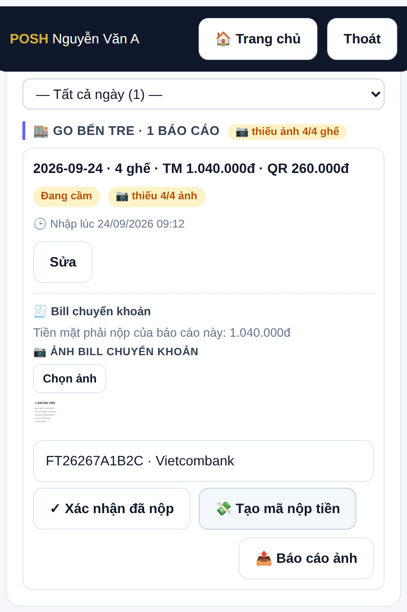

**Bước 3. Bấm "✓ Xác nhận đã nộp".** Máy hỏi lại một lần, nói rõ ba việc sắp xảy ra: ảnh bill đính
vào phiếu; một **lượt nộp** bằng đúng số tiền mặt hiện lên cho kế toán bấm Đã nhận; **phiếu khoá**,
không sửa được nữa.

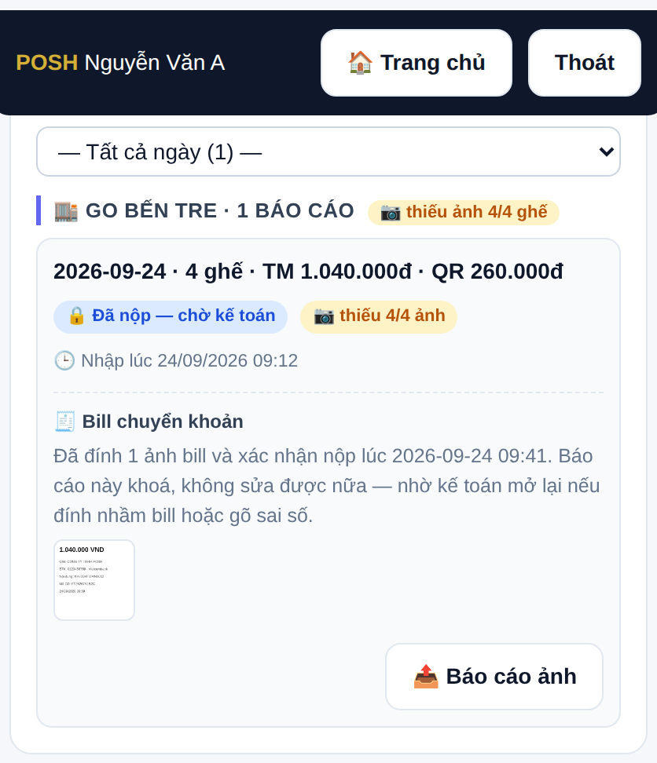

Điều kiện: **phải có ít nhất một ảnh bill** (không ảnh thì máy chối); chỉ **người gửi phiếu** bấm
được, **trong 24 giờ**; phiếu đã đính bill thì không sửa, không nộp bổ sung được nữa. Đính nhầm bill
hoặc gõ sai số thì nhờ kế toán **Mở khoá báo cáo** (mục 3.5).

### 3.4 Cách B — mang tiền mặt về quầy / kế toán

Vào **Quỹ & nộp tiền** (trang chính, đăng nhập bằng tài khoản nhân viên).

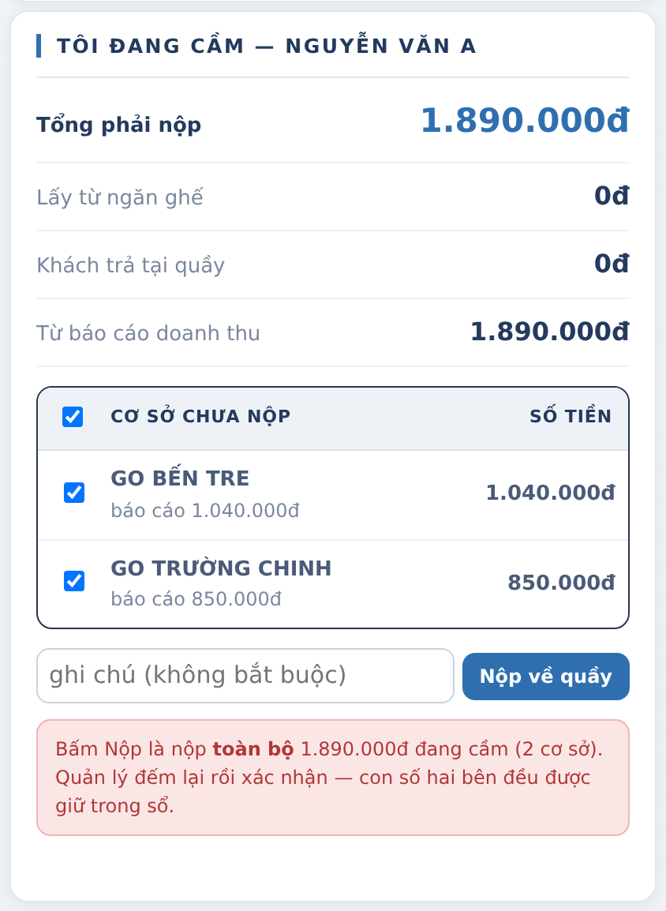

- Khối **Tôi đang cầm** cộng mọi khoản còn trên tay: từ ngăn ghế (chốt ca), khách trả tại quầy, và
  **từ báo cáo doanh thu** (tiền mặt các phiếu chưa nộp).
- Phụ trách nhiều cơ sở thì có bảng **Cơ sở chưa nộp** với ô tích: mặc định tích hết; bỏ tích cơ sở
  chưa mang tiền về, số tổng đổi theo.
- Bấm **Nộp về quầy** → một **lượt nộp** ở trạng thái *chờ* xuất hiện bên kế toán. Tiền vẫn ghi là
  của nhân viên cho tới khi kế toán đếm và bấm Đã nhận.

### 3.5 Kế toán xác nhận (tab Quỹ & nộp tiền)

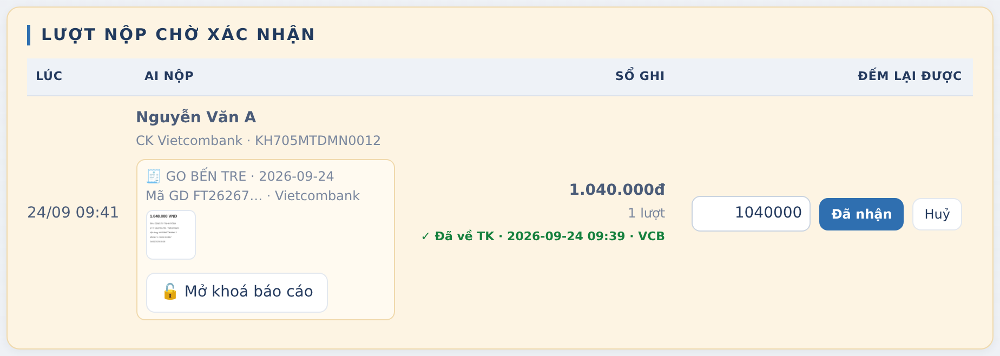

Khối **Lượt nộp chờ xác nhận** (nền vàng) liệt kê từng lượt: giờ, ai nộp, ghi chú, **ảnh bill thu
nhỏ** (rê chuột phóng to, bấm mở tab), số **Sổ ghi** (máy cộng), và gợi ý đối chiếu:
- **✓ Đã về TK · giờ · ngân hàng**: sao kê có khoản tiền vào khớp đúng số tiền.
- **⚠ Chưa thấy trên sao kê**: kiểm lại bill trước khi nhận.

Kế toán gõ số **đếm lại được** (mặc định bằng sổ ghi) rồi bấm:
- **Đã nhận** → lượt sang *đã nhận*, phiếu sang **Kế toán đã nhận**, hết nợ. Lệch thiếu / thừa được
  ghi vào lượt, không sửa số của phiếu.
- **Huỷ** → xoá lượt nộp, tiền quay về **Đang cầm** của nhân viên (chỉ huỷ được khi còn *chờ*).
- **🔓 Mở khoá báo cáo** (bắt buộc lý do) → gỡ bill, phiếu sửa lại được. Không mở được khi lượt đã
  *đã nhận*.

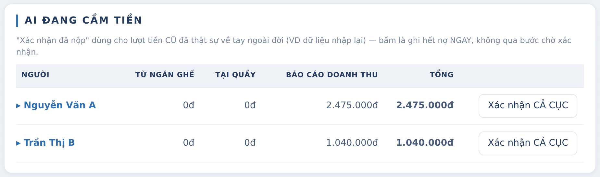

Khối **Ai đang cầm tiền** là sổ nợ theo người. Bấm **tên nhân viên** để mở **từng ngày chưa nộp**:

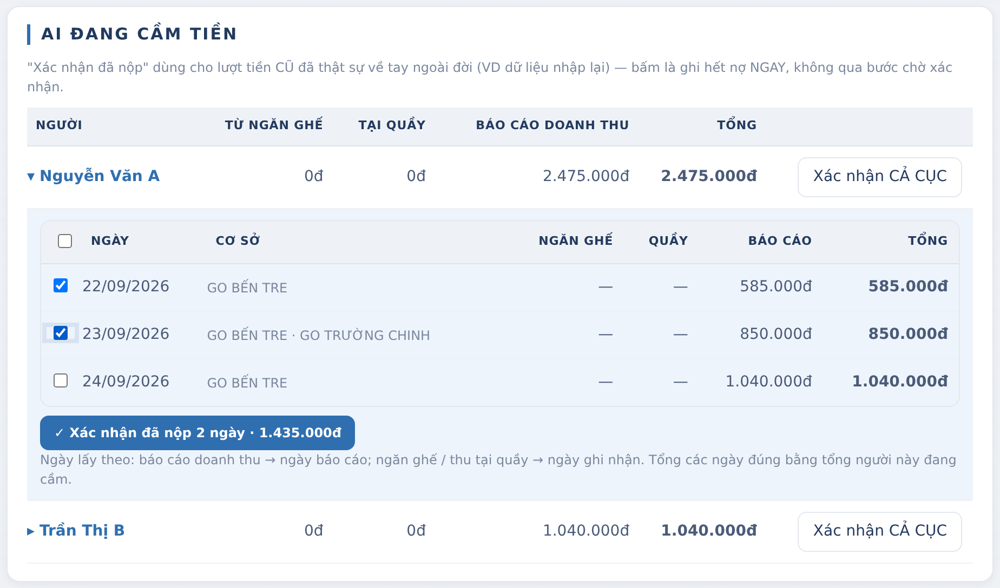

- Tích những ngày kế toán **đã thật sự nhận tiền** → **✓ Xác nhận đã nộp N ngày · số tiền**. Máy
  hỏi lại, liệt kê đúng các ngày, rồi ghi hết nợ **chỉ cho các ngày ấy**; ngày khác giữ nguyên.
  Đây là cách dùng khi nhân viên nộp từng ngày lẻ, không chốt được cả cục.
- **Xác nhận CẢ CỤC**: ghi hết nợ toàn bộ của người ấy ngay, không qua bước chờ. Dùng cho tiền cũ đã
  về tay ngoài đời (dữ liệu nhập lại), không dùng cho tiền đang nộp hằng ngày.

### 3.6 Nộp thiếu, chưa nộp, nộp bổ sung

- Khai **Chưa nộp**, hoặc gõ số tiền nộp nhỏ hơn tiền mặt phải nộp → phần còn lại là **nợ** của
  nhân viên trên phiếu; khối **Nộp bổ sung** trên màn báo cáo liệt kê các phiếu còn nợ để nộp thêm.
- **Nộp bổ sung** cộng vào phiếu cũ; bị chặn nếu phiếu đã đính bill hoặc ngày đã khoá.
- Tab **Doanh thu đã nộp**: dò **MÃ NỘP** trong sao kê ngân hàng theo ngày → cột *Đã nộp* và *Còn
  lại* cho từng cơ sở (đỏ khi thiếu). Cơ sở "chưa đặt mã" thì vào Sao Kê đặt mã.

### 3.7 Việc của ai, khi nào

| Ai | Khi nào | Làm gì |
|---|---|---|
| Nhân viên | Ngay khi gửi phiếu | Chọn hình thức nộp, số tiền (trống = đủ) |
| Nhân viên | Trong 24 giờ | Chuyển khoản theo mã nộp → đính bill → Xác nhận đã nộp; hoặc Nộp về quầy |
| Kế toán | Hằng ngày | Đối chiếu bill với sao kê, bấm Đã nhận / Huỷ; xác nhận theo ngày ở Ai đang cầm tiền |
| Kế toán | Khi nhân viên đính nhầm | Mở khoá báo cáo (có lý do) |
| Kế toán | Cuối kỳ | Khoá ngày; nợ còn treo hiện ở Ai đang cầm tiền và Theo người thu |

---

## 4. Kế toán: duyệt, khoá, đối soát, xuất MISA

### 4.1 Hằng ngày
1. **Duyệt báo cáo**: lọc tháng / ngày / cơ sở / nhân viên. Khối **"Cơ sở chưa nộp báo cáo hôm nay"** chạy theo lịch tuần của từng cơ sở.
   Nhìn cờ ⚠ (bất thường), số ghế thiếu ảnh.
2. **Sửa tại chỗ** khi cần (quyền *Sửa báo cáo đã nộp*): chỉ số trước tay, ghi đè / bỏ ghi đè Thực thu, thêm hoặc xoá ảnh.
   Có hoàn tác. Bị chặn khi ngày đã khoá.
3. **Duyệt** từng ghế hoặc **duyệt cả ngày** → ✓. Đây là căn cứ xuất MISA.
4. Xử lý **Đề nghị** của nhân viên (đặt lại / xoá mốc chỉ số) và tạo **Yêu cầu** cho cơ sở (bổ sung / sửa). Yêu cầu tự đóng khi nhân viên gửi hoặc sửa đúng cơ sở và ngày.
5. **Nhận tiền**: *Đã nhận* từng lượt nộp, hoặc xác nhận theo ngày ở *Ai đang cầm tiền*. Gỡ bill khi cần.

### 4.2 Định kỳ
6. **Đối soát QR**: gán QR = số thật về ngân hàng (giữ nguyên tiền mặt). Lớp **VietQR thực** lấy từ Sao Kê theo cơ sở, ngày và **từng máy**; máy nào lệch hiện ngay trên *Báo cáo tổng → Từng ghế × QR*.
7. **Khoá ngày** sau khi duyệt xong và tiền đã về: một cơ sở hoặc tất cả.
   Khoá chặn: gửi / sửa báo cáo, nộp bổ sung, kế toán sửa / xoá / đổi ngày, áp QR. Không chặn: nhận tiền, đính bill. Mở khoá: kế toán hoặc quản trị.
8. **Công nợ**: đặt dư đầu kỳ, chốt tháng, mở lại khi cần.
9. **Cuối tháng xuất MISA**:
   - *Chứng từ*: Nợ 131 / Có 5113; **Mã đối tượng = Mã KH** của cơ sở; QR lấy **số thực** từ sao kê, chia theo tỉ lệ về từng ghế.
   - *Daily report*: theo **Unit ID**, xếp theo tỉnh, có dòng cộng tỉnh.
   - Cơ sở đã đóng cửa không phát sinh thì không ra; có phát sinh vẫn ra bình thường.
   - Cơ sở **thiếu Unit ID hoặc Mã KH** hiện lên đầu danh sách để bổ sung trước khi xuất.
   - Đánh dấu **đã xuất** theo ngày để không xuất hai lần.
10. **Báo cáo tổng** (tối đa 92 ngày): theo cơ sở hoặc từng ghế; cột TỔNG = tiền mặt thực + VietQR thực; dòng VietQR đỏ là tiền về thật. Xuất CSV mang đúng số đỏ.

---

## 5. Quản trị: danh mục và dọn sổ

- **Địa điểm**: thêm / sửa cơ sở, tỉnh, **Mã KH**, **Unit ID / Tên MISA**, lịch báo cáo tuần, reset sau mỗi lần thu, **đóng cửa** (ẩn khỏi danh sách, không xoá gì).
- **Ghế**: mã ghế, tên ghế (phải khớp tên máy bên cổng VietQR), đổi cơ sở, ẩn / xoá hẳn mã không còn dữ liệu.
- **PIN báo cáo**: cấp phạm vi cơ sở cho từng nhân viên; PIN tắt = không được báo cáo.
- **Gộp cơ sở ⇄** (từng hàng): dời ghế + toàn bộ sổ báo cáo sang cơ sở giữ lại, tên cũ thành **bí danh** (tiền VietQR mang tên cũ vẫn về đúng chỗ), rồi xoá cơ sở cũ.
- **📒 Tên cũ còn trong sổ**: cơ sở đã xoá hoặc đổi tên mà báo cáo cũ còn mang tên ấy (MISA ra hai dòng) → chọn cơ sở đúng → **Gộp sổ**. Chỉ đổi nhãn, không đụng tiền.
- **Đổi tên cơ sở** nay kéo sổ đi theo; đổi sang tên đang thuộc cơ sở khác thì máy chối và chỉ sang ⇄.
- **Bổ sung doanh thu tháng cũ** (chỉ Admin): nhập tổng / tiền mặt / QR theo tháng cho cơ sở chưa có dữ liệu ngày; hiện trong *Lịch sử* với nhãn "bổ sung".
- **Nhật ký hệ thống** ghi mọi thao tác trên: ai, lúc nào, làm gì.

---

## 6. Bảng trạng thái tra nhanh

| Đối tượng | Trạng thái |
|---|---|
| Phiếu báo cáo | Đã gửi (lần 1, 2…) → Sửa được 24 giờ → Kế toán đã duyệt ✓ → Ngày đã khoá 🔒 |
| Tiền của phiếu | Đang cầm → Đã nộp, chờ kế toán → Kế toán đã nhận |
| Hình thức nộp | Tiền mặt / Chuyển khoản / Chưa nộp · số tiền: đủ / thiếu / chưa nộp |
| Lượt nộp (quỹ) | Chờ → Đã nhận (báo thiếu / thừa); huỷ được khi còn chờ |
| Đề nghị mốc chỉ số | Chờ duyệt → Duyệt / Từ chối |
| Yêu cầu của kế toán | Chờ làm → Đã làm / Huỷ |
| Phiên thu trong ngày | Đang thu → Đã gửi đủ / Chốt sớm (có lý do) |

---

## 7. Điểm còn dở, cần anh quyết

1. **Thực thu chưa bắt buộc.** Nhân viên không gõ Thực thu thì tiền mặt = sản lượng máy − QR, tức vẫn suy từ chỉ số máy. Muốn TỔNG đúng nghĩa "tiền thật" thì phải bắt buộc gõ Thực thu ở mọi ghế.
2. **Không có ô số tham chiếu chuyển khoản** ở màn nhân viên; đối chiếu CK dựa vào **mã nộp** trong nội dung chuyển khoản và bill ảnh.
3. **Không có nhắc tự động** (không gửi tin, không email). Nhắc chỉ có: thanh tiến độ, khối "chưa nộp báo cáo hôm nay", bảng ngày chưa nộp ở *Ai đang cầm tiền*.
4. **Kích ghế từ xa** trừ khỏi sản lượng theo giá riêng của ghế; cần Hotline ghi đúng số lượt cấp.
